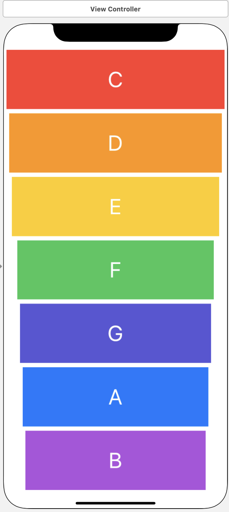

# Xylophone

## Our Goal

This is a musical instrument! A Music app, which is a colourful XyloPhone app.

## What is used
* using AVFoundation and AVAudioPlayer.
* Functions and methods in Swift. 
* Data types.
* Swift loops.
* Variable scope.
* The ViewController lifecycle.
* Error handling in Swift.
* Code refactoring.
* Basic debugging.

## Portrait

## Landscape

